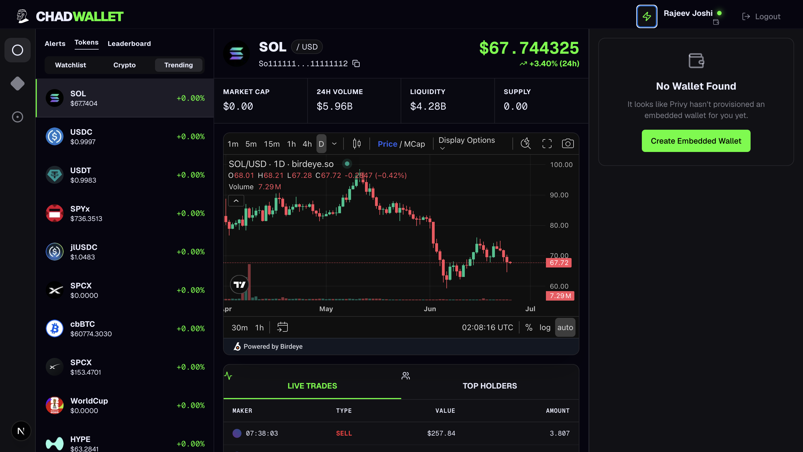

# ChadWallet



## What is this project?

ChadWallet is a modern, high-performance web application designed for the Solana ecosystem. It serves as an intuitive and frictionless gateway for users to discover trending tokens, view real-time market data, and execute decentralized swaps without the steep learning curve typically associated with crypto wallets.

## Why was this project created?

This project was developed as part of a Founding Engineer assessment for ChadWallet. The core objective was to build an application that mirrors the premium aesthetic of top-tier platforms (like fomo.family) while integrating a robust set of Web3 tools. The goal was to prove that complex blockchain interactions—like wallet creation and token swapping—can be abstracted into a seamless, user-friendly, "gasless-feeling" Web2-style experience.

---

## End-to-End Implementation View (What We Built)

To fully satisfy the assessment requirements, this project implements a complete end-to-end user journey:

### 1. The Landing Page & Discovery

- **Brand Assets & Aesthetic:** We strictly implemented the ChadWallet branding, utilizing the provided assets and applying a "fomo.family" inspired dark-mode glassmorphism design.
- **Mobile Links:** App Store and Google Play links are prominently featured for mobile conversion.
- **Live Market Marquees:** Two rotating banners display live, trending Solana tokens (fetched from BirdEye). Clicking any token instantly drops the user into that token's specific trading dashboard.

### 2. Frictionless Authentication

- **Privy Integration:** Users can click "Login" and authenticate via **Google** or **Apple**.
- **Embedded Wallets:** The moment they log in, Privy seamlessly provisions an invisible, non-custodial Solana wallet in the background. No seed phrases, no Chrome extensions required.

### 3. The Trading Dashboard (`/trade/[token]`)

The trading interface is divided into three highly functional panels:

- **Left Panel (Discovery):** A live-updating sidebar of the top trending tokens on Solana.
- **Middle Panel (Analysis):**
  - Displays real-time token metrics (Price, Market Cap, 24h Volume).
  - Embeds a professional-grade **TradingView Chart** for the selected asset.
  - Features tabs displaying the most recent **Live Trades** and top **Token Holders**.
- **Right Panel (Action):** The swap interface. Users input an amount of SOL to swap for the token.

### 4. Swap Execution Flow

When a user clicks "Swap", the backend automatically:

1. Fetches the absolute best price route across all Solana DEXs using the **Jupiter Aggregator API**.
2. Retrieves a serialized swap transaction.
3. Prompts the user's embedded Privy wallet to sign the transaction.
4. Broadcasts the signed transaction to the Solana network via the **Alchemy RPC**.

---

## Third-Party Libraries, SDKs & Infrastructure

Here is the exact breakdown of the tooling we used to build this architecture:

- **Next.js 16 & Tailwind CSS:** Next.js provides the App Router, allowing us to build secure, server-side API routes (`/api/birdeye`) to hide our secret API keys from the browser. Tailwind allowed us to rapidly execute the complex responsive layouts and premium aesthetic.
- **Vercel:** Used for zero-config, immediate CI/CD deployment. It leverages edge networks (powered by Cloudflare under the hood) for global caching and lightning-fast page loads. _(Note: Supabase was skipped as this specific milestone did not require a custom relational database, saving unnecessary overhead)._
- **Privy (`@privy-io/react-auth`):** The engine behind our social authentication (Google/Apple) and the automatic generation of embedded Solana wallets.
- **BirdEye API:** The industry standard for Solana data. We used it to power the live Trending Tokens, historical price data, holder lists, and live trade history.
- **RPC (Alchemy):** Once our user's embedded wallet signs a transaction, we broadcast it directly to the blockchain via our highly reliable Alchemy RPC node.
- **TradingView:** To avoid bloating our app size by building a custom charting library from scratch, we integrated the highly optimized TradingView widget (provided via BirdEye).
- **Jupiter API:** We used Solana's premier liquidity aggregator to fetch optimal price quotes and generate the exact transaction instructions needed to execute trades.
- **Zustand & React Query:** Zustand handles global UI state (like the Light/Dark theme), while React Query handles caching our BirdEye API requests so we don't spam the network when components re-render.

## Project Structure

```text
ChadWallet/
├── docs/                      # Extensive end-to-end and technical documentation
├── public/                    # Static assets (images, logos, SVGs)
├── src/
│   ├── app/                   # Next.js App Router (Pages, Layouts)
│   │   ├── api/               # Server-side Route Handlers (API proxies for BirdEye/Jupiter)
│   │   ├── trade/             # Trading Dashboard routes
│   │   └── page.tsx           # Landing Page
│   ├── components/            # Reusable React UI Components
│   │   ├── auth/              # Auth buttons and protected route wrappers
│   │   ├── swap/              # Jupiter swap interface
│   │   └── ui/                # Base UI elements (Buttons, Tables, Tabs)
│   ├── config/                # Environment variable validation and config
│   ├── hooks/                 # Custom React hooks (useAuth, useBirdeye, useJupiter)
│   ├── store/                 # Zustand state stores
│   └── lib/                   # Utility functions (formatting, clsx)
├── next.config.ts             # Next.js configuration and SVG security policies
├── tailwind.config.ts         # Tailwind theme, colors, and animations
└── package.json               # Project dependencies and scripts
```

## Roadmap (Future Iterations)

1. **Portfolio Tracking:** A dedicated dashboard for users to view their embedded wallet's token balances and historical performance.
2. **Fiat On-Ramp:** Integration with Stripe or MoonPay to allow users to purchase SOL directly with a credit card to fund their embedded wallets.
3. **Advanced Charting:** Native integration of the full TradingView Lightweight Charts library for custom indicators.
4. **Transaction History:** A clean, readable list of past swaps and transfers parsed from the Solana blockchain.
